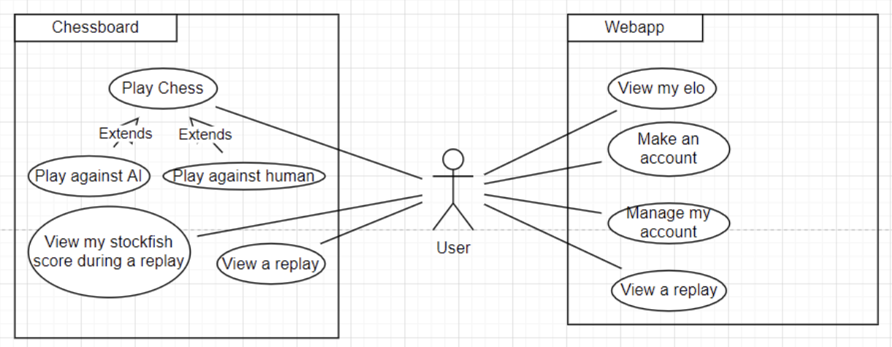
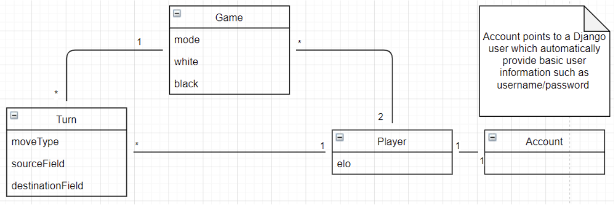
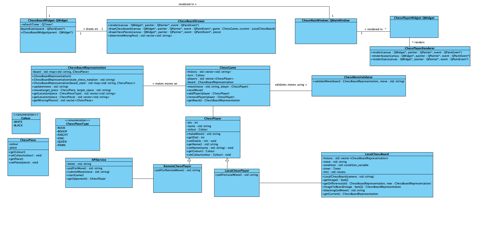
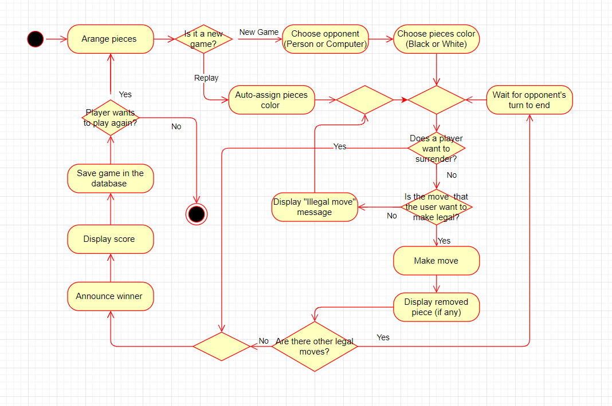
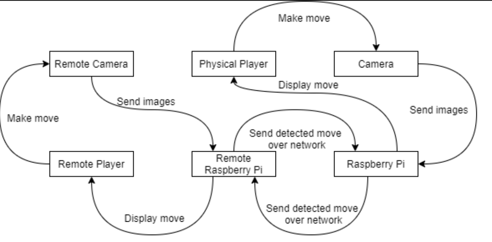
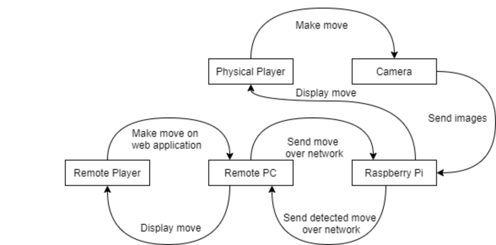
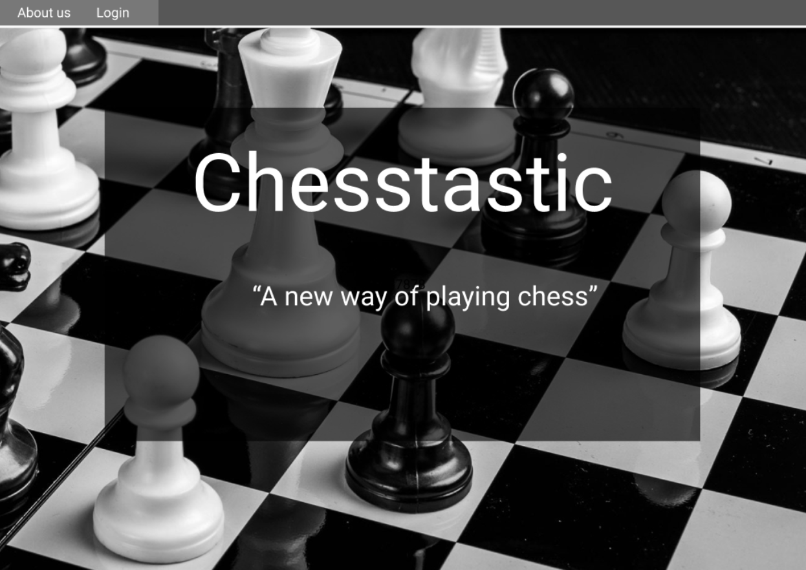
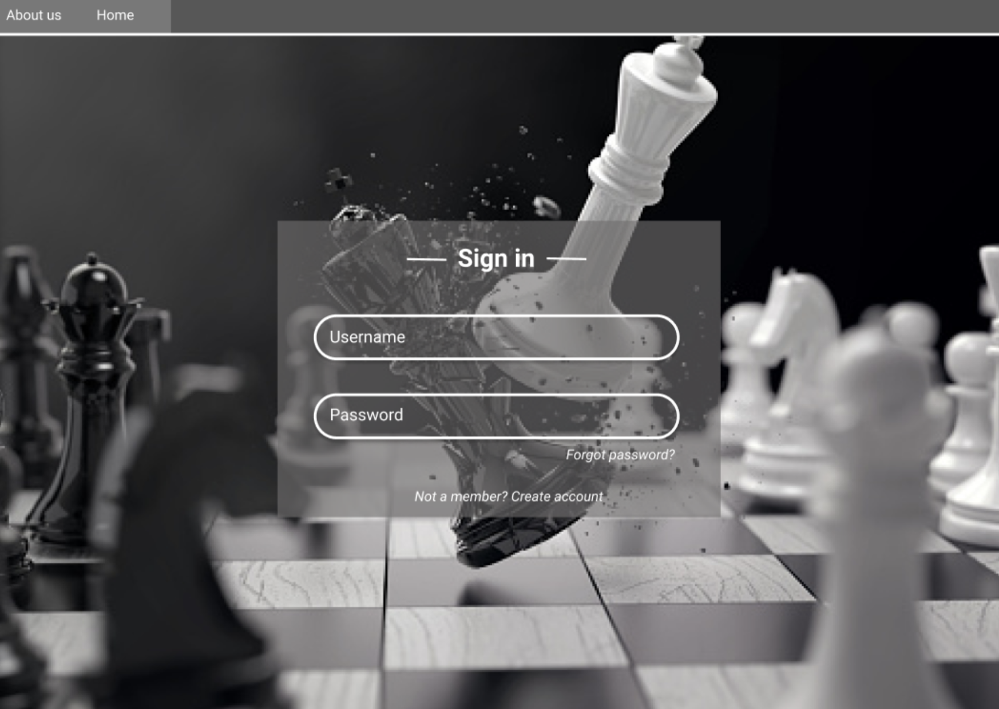
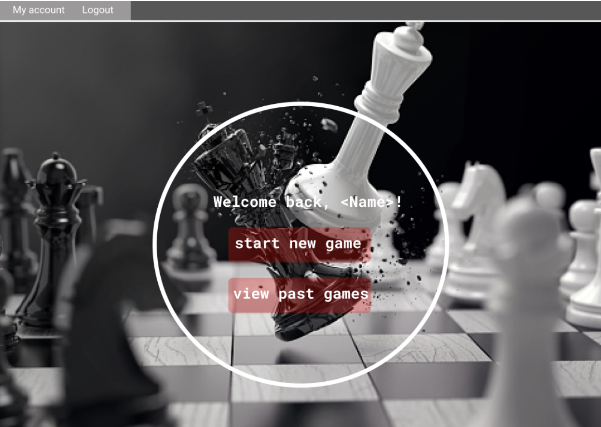
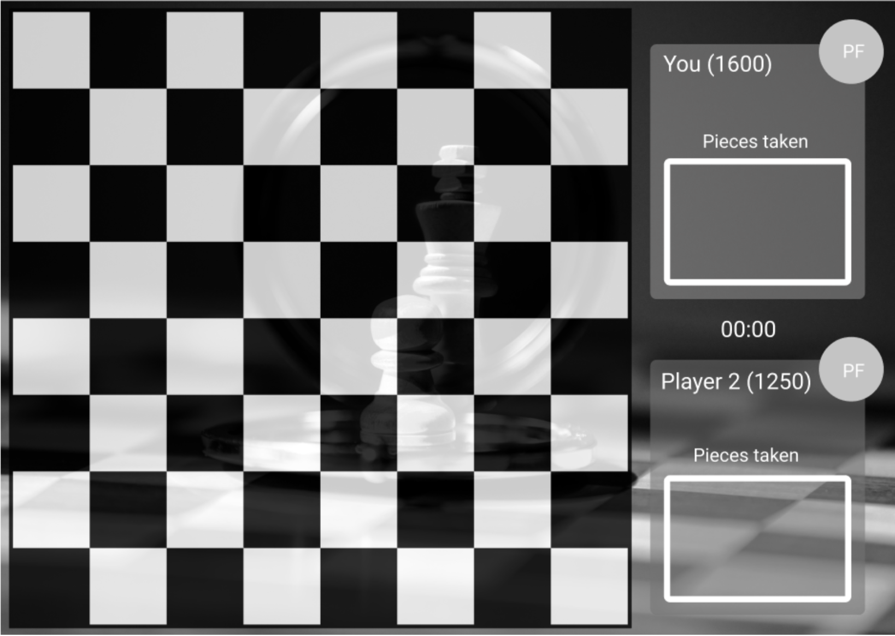

# SDD
---

Project name|Team members
-|-
Chesstastic|Antoniu Gorgan 
&nbsp;|Dawid Kulikowski 
&nbsp;|Jesse Snoijer 
&nbsp;|Jitka Bojorge-Alvarez 
&nbsp;|Mark Boom 
&nbsp;|Silas de Graaf 

## 1. Introduction
Our product is a combination of a chessboard and a virtual chessboard. It uses the advantages of both, being able to actually feel the game but also being able to play with an opponent from a distance. Our project consists of a monitor connected to a Raspberry Pi, a camera that is connected to the Raspberry Pi and a server which runs on a different Raspberry Pi. On the monitor is a chessboard and the chess pieces of the opponent displayed. The monitor will be laying flat on the table so you can put your own physical chess pieces. Movement of your chess pieces will be recognized by the camera and will be uploaded to your opponent's board. This way a game can be played.

## 2. Functional / Non Functional requirements
_Not included; we did not update our requirements_

## 3. Architectural Design
Our system is designed with three basic components in mind:

* **Our semi-digital chessboard**  
A monitor (connected to a Raspberry Pi) which stays flat on a table and displays a chessboard. Your “own” pieces can be placed physically on the monitor. The pieces of your opponent will be displayed as well. A camera is pointed at the player and tracks moves of chess pieces.
* **A web server**  
The web server powers the entire application, handles the database and provides API endpoints. It can be hosted anywhere; we’ll use one of the spare Raspberry Pis for this.
* **The users’ device**  
This can be any large-sized device from tablet to laptop.

**Technologies**

* The semi-digital chessboard is powered by a C++-program with Qt that runs on it’s attached Pi
* The web server is powered by Python, using the Django framework
* The clients’ devices will use their own browser to interact with the web server; the last two versions of every actively supported browser are supported

**Use case diagram**  
We started by identifying the different use cases our different components will have. We don’t have many different actors within our system, as all users have equal capabilities. There are two different components however, which feature their own unique use cases.

**Class diagrams**  
Below you will find a class diagram of (part of the) web server side. We’ll also use this diagram to start building our database scheme.

We made a second class diagram outlining the class architecture in the client-side (C++) application:

**Activity diagram**  
The activity diagram below offers a view of the activities our software should be able to perform during a complete match of chess.  

**Data flow diagrams**  
The data flow diagrams below show the flow of data when making a move within our system. There is no beginning or end since we are abstracting away from the game logic for this diagram. The more complicated activity diagram gives a better understanding of the game logic, while the simpler data flow diagrams should give a better understanding of the networking and inner state of the software system during a game. The first diagram shows the situation where two players using the chessboard play a game together, while the second diagram shows the situation where only one player is using the chessboard and the other player is playing the game on the web application.

## 4. User interface

This page is the startpage which will be shown when going to the website/webserver. Up top is a menu where you can choose to login, or find out more information about our project & chess in general. 

This will be our login page. Up top you can again choose to go to the home page or the about us page. Here a user can login with their username and password. If the user has forgotten their password, the user can click on ‘forgot password’ to reset it. A new user can also choose to create a new account.

Once a user successfully logs into the website, the loggedInPage will be shown. Here the user can start a new game, or view games played in the past (if applicable). Up top a user can choose to logout or go to ‘my account’, where they can see their details. They may also edit their user information (such as email address) or choose a new profile picture.

Once a user has chosen to play a game and successfully found an opponent, this page will be shown on the monitor (on which the physical pieces will be placed). Here you can see the ELO score of yourself and your opponent, the time, and the pieces you have taken from your opponent. In the two small circles, the users pictures will be displayed. 

## 5. Prevention/Mitigation Criteria (Security Controls)

Security Policy|Risks|Solutions
-|-|-
Autentication|The device is shared with other people|Users are authenticated with username and password.
&nbsp;|The device gets breached|We will not protect our system against physical breaches
&nbsp;|Both the code and the password can be brute forced due to no rate limiting|Implementation of a purposefully slow password hashing algorithm in combination with strong enough passwords will protect against this
&nbsp;|A master password/pin exists|Users should never handle a master password, only machine-to-machine
&nbsp;|API endpoints allow unauthenticated users|Our chosen framework prevents this by default
Authorization & Authorization|The token is too short|We enforce a minimum password length; all other (permanent) tokens are fixed in length and long enough
&nbsp;|The token is not random|Tokens and/or passwords are always generated by cryptographic library functions
Audit|Someone gains access to the server as a admin who is not an admin|Passwords are always safely hashed; the integrity of all other data is compromised in this scenario
&nbsp;|Someone steals the harddrive where the backup is stored|Any backups will be encrypted at rest, therefore unusable to any attacker
&nbsp;|We forgot to comply with a law|Within the design of our system, we made sure that we comply to relevant GDPR regulations (having said that - we’re storing almost no PII)

## 6. Cost for security controls
Except for time there is no cost in terms of money. Most security controls are supplied by the chosen framework(s). To guarantee this is implemented well, time is required. This time consists of two parts:

* A bit of time required at each code review, which can be factored in into overall review time
* 2-4 hours towards finalizing the project for a final security check, in which a developer goes over the code with the security aspect in mind

## 7. Conclusion
To conclude, this Software Design Document reflects the architecture of our proposed system. It features modular components which interact with each other in a transparent manner. Security has been top of mind from the very beginning so we can ensure a secure end product. This architecture will enable us to fulfill all must-have requirements as well as keeping our application extensible to enhance it with any extra features should there be time and/or desire for those. Detailed diagrams show the design is feasible and provides a great tool for our developers to start building the software system.
